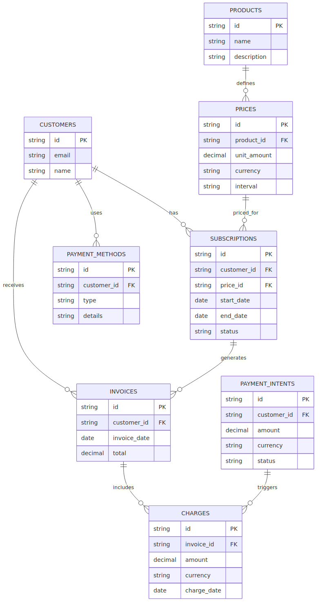

# Stripe Data Architecture Project

> 📊 A complete data modeling and pipeline architecture proposal for Stripe, covering OLTP, OLAP, and NoSQL systems.

---

## 🔍 Overview

This project presents a full-stack data engineering architecture tailored to Stripe's complex data ecosystem. The focus is on integrating real-time transactional integrity, scalable analytics, and flexible unstructured data management — all while ensuring compliance and high performance.

---

## 🧱 OLTP – Transactional Data Architecture

### 🎯 Purpose

The OLTP system supports real-time processing of high-frequency operations such as:

- Payments
- Subscriptions
- Invoices
- Charges
- Customer metadata

### 📌 Diagramming Process

To design a robust and normalized schema for OLTP, we followed these steps:

1. **Conceptual Design** – Entity identification and relationship mapping from Stripe’s API objects.
2. **Logical Design** – Normalization (1NF → 3NF), primary/foreign key constraints, relationship modeling.
3. **Physical Representation** – Diagrammed using `erDiagram` in Mermaid v10+.

The diagram above (`schema/schema_er.png`) was generated using [Mermaid CLI](https://github.com/mermaid-js/mermaid-cli) and is also available as a raw `.mmd` source for editing.

### ✅ Core Tables Modeled

- `CUSTOMERS`
- `PRODUCTS`
- `PRICES`
- `SUBSCRIPTIONS`
- `INVOICES`
- `CHARGES`
- `PAYMENT_METHODS`
- `PAYMENT_INTENTS`

Each table is designed with primary and foreign keys to support **ACID-compliant**, highly consistent operations.

### Schema

<p align="center">
  
  <br/>
  <em>Figure 1 – OLTP Entity-Relationship Diagram for Stripe</em>
</p>

---

## 📊 OLAP – Analytical Data Architecture

> _Section coming soon._

This part will focus on designing a **star/snowflake schema** for Stripe’s business intelligence needs — including revenue analytics, product performance, and fraud metrics.

---

## 🧩 NoSQL – Flexible & Unstructured Data Layer

> _Section coming soon._

We will cover log management, real-time behavior tracking, customer feedback indexing, and ML model inputs using **document-oriented databases**.

---

## 📂 Structure

```

.
├── schemas/
│   ├── schemas\_er.mmd         # Mermaid file (editable)
│   └── schemas\_er.png         # Rendered ER diagram
├── src/
│   └── ...                   # ETL, DDL, transformation scripts (optional)
├── README.md

```

---

## ⚙️ Tools Used

- [Mermaid JS](https://mermaid.js.org) v10+
- [Mermaid CLI](https://github.com/mermaid-js/mermaid-cli)
- PostgreSQL / SQLAlchemy (coming soon)
- Visual Studio Code

---

## 📌 Next Steps

- [ ] OLAP schema + Snowflake modeling
- [ ] NoSQL document model
- [ ] SQL + SQLAlchemy implementation
- [ ] Data pipeline architecture

---

© 2025 — Built with 💙 by [Arthur Cornélio](https://github.com/arthurcornelio88)
```