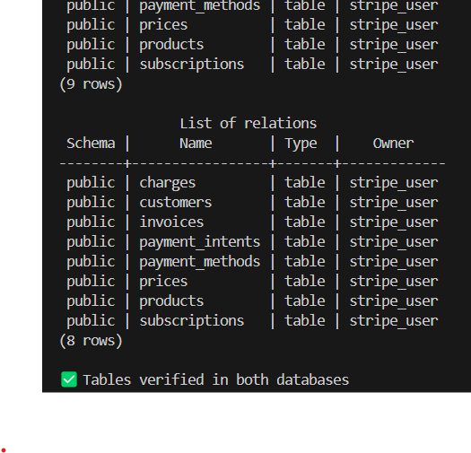
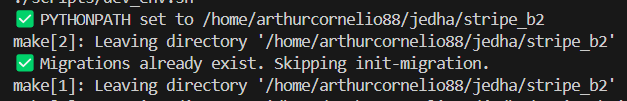

# 🏠 Stripe OLTP Data Pipeline

> End-to-end system to populate, fetch, ingest and verify transactional Stripe data in a controlled PostgreSQL environment. This README documents **everything from scripts to schema**, giving full reproducibility, safety, and insight into your OLTP foundation.

---

## 🌐 Environment-Safe Design

This pipeline is explicitly **environment-aware**. By default, everything is run in:

* `ENV=DEV`: full feature access
* `ENV=PROD`: blocks destructive/populating commands

```bash
make populate                # allowed in DEV
make populate ENV=PROD       # ❌ blocked
```

---

## 📂 Project Structure

Here's how the OLTP layer is organized, combining database models, transformers, and ingestion logic:

```
app/
├── db/
│   ├── base.py              # Base SQLAlchemy class
│   └── session.py           # DB session factory
├── models/                  # ORM classes mapping to Stripe
├── transformers/            # Stripe JSON to model converters
scripts/
├── ingest/                 # Per-table ingestion scripts
├── fetch_*.sh              # Bash scripts for Stripe API fetch
├── populate.py             # Populates sandbox using fixtures
├── check_db_integrity.py   # Validates row counts
tests/
├── ingest/                 # Test ingest per table (GraphQL-style: test_price.py, etc.)
├── test_customer.py        # Customer ingestion, placeholder, duplicates
├── test_charge.py          # Charge ingestion, deduplication
```

The design ensures modularity, testability, and adherence to Stripe’s schema.

## ⚡ Step 0: in a rush

### 🔧 `.env.dev` and `.env.prod`

Split from `.env.example` template:

```bash
# ========================
# Environnement LOCAL DEV
# ========================
ENV=DEV
POSTGRES_USER=postgres
POSTGRES_PASSWORD=
POSTGRES_DB=postgres
POSTGRES_PORT=5432
POSTGRES_HOST=localhost
POSTGRES_TEST_DB=postgres_test
POSTGRES_TEST_PORT=5433
STRIPE_API_KEY=<sk_test_...>

# ========================
# Environnement PROD
# ========================
ENV=PROD
POSTGRES_USER=postgres
POSTGRES_PASSWORD=<TON_MOT_DE_PASSE_SUPABASE>
POSTGRES_DB=postgres
POSTGRES_PORT=5432
POSTGRES_HOST=db.<ton-projet>.supabase.co
STRIPE_API_KEY=<sk_live_...>
```

> **Note:** For Supabase, use the **IPv4 connection pooling string** (found under Project > Database > Connection Pooling). This ensures compatibility with `psycopg2`.

### 🚀 CLI bootstrap

```bash
# 1. Clone the repo
git clone https://github.com/arthurcornelio88/stripe.git
cd stripe

# 2. Sync the environment
uv sync

# 3. Activate the virtual environment
source .venv/bin/activate

# 4. Activate your Docker System

# 5. Do everything in one go: init, migrate, populate, fetch, ingest, verify
make all ENV=DEV

# 6. Production-safe ingest
make all ENV=PROD INGEST_SOURCE=api
```
---

## 📆 Step 1: Create Databases & Tables

If you have time to understand what's happening and if you want have more control of the workflow, start by here. Don't forget to set the environment variables, as describe in `Step 0`.

### `make init-db` runs:

* Docker Compose boot
* `init_db.py` connects via psycopg2 to create `stripe_db` and `stripe_db_test`
* Table creation via `Base.metadata.create_all`

```python
create_db_if_not_exists("stripe_db_test", admin_url)
Base.metadata.create_all(engine)  # applied to both DBs
```

The **test database** (`stripe_db_test`) is used by CI and Pytest for isolated evaluation.

📸 *Result after boot:*




---

## 🧪 Unified Dev + Test Setup and DB Connection

The OLTP pipeline is now fully **Dev + Test + Prod ready**.

* ✅ `ENV=DEV` uses two isolated databases: `stripe_db_dev` (port 5434) and `stripe_db_test` (port 5435)
* ✅ Both databases are defined in **`.env.dev`**, no need for `.env.test`
* ✅ Containers are fully isolated using Docker Compose services: `stripe_db_dev` and `stripe_db_test`
* ✅ `init_db.py` creates both DBs and their schemas in one go

```bash
docker-compose up -d        # spins up both DB containers
make init-db                # creates stripe_db_dev + stripe_db_test
```

**Postgres architecture:**

| Container        | Port | DB Name          | Use         |
| ---------------- | ---- | ---------------- | ----------- |
| `stripe_db_dev`  | 5434 | `stripe_db_dev`  | Main ingest |
| `stripe_db_test` | 5435 | `stripe_db_test` | Pytest CI   |

### ✅ Running tests

Tests run on a completely separate DB (`stripe_db_test`) via `make test`:

```bash
make test
```

Tests use:

* SQLAlchemy fixture-based setup
* Auto table reset between functions
* Transactional rollbacks per test

📸 Result:


---

### ✅ What the Tests Actually Validate

All unit tests pass successfully and validate core ingest and transformation logic. Some examples:

---

#### 🧱 Customer placeholder logic

**`test_ensure_deleted_customer_placeholder_created`**: simulates the creation of a synthetic "deleted" Stripe customer
Verifies placeholder flags, null fields, and Stripe metadata for ghost objects (`cus_DELETEDxxx`)

---

#### 👤 Customer ingestion

**`test_customer_insertion`**: ingests a valid Customer object from fake Stripe JSON
Checks persistence and field mapping (`email`, `created`, `livemode`, etc.)

**`test_duplicate_customer_is_skipped`**: simulates a second ingestion and ensures the first version is preserved
Verifies idempotency by counting only one row for the same `customer.id`

---

#### 💳 Charge ingestion

**`test_charge_insertion`**: inserts a valid Charge linked to mock `Customer`, `Invoice`, and `PaymentIntent`
Checks amount fields, foreign keys, and charge-specific metadata (`paid`, `captured`, `receipt_*`)

**`test_duplicate_charge_is_skipped`**: inserts a Charge that already exists and ensures no duplicate is stored
Asserts that the table contains only one instance of the charge ID

---

### 🔁 Stripe Sync Scripts (Live Ingestion)

A full set of `sync_*` ingestion scripts maps Stripe live API objects into normalized Postgres tables.
Each script follows the correct dependency graph to maintain referential integrity.

| Step | Resource        | Script name             | Depends on                    |
| ---- | --------------- | ----------------------- | ----------------------------- |
| 1    | Products        | `sync_products()`       | –                             |
| 2    | Prices          | `sync_price()`          | `products`                    |
| 3    | Customers       | *(covered in tests)*    | –                             |
| 4    | Payment Methods | `sync_payment_method()` | `customers`                   |
| 5    | Subscriptions   | `sync_subscription()`   | `customers`, `prices`         |
| 6    | Payment Intents | `sync_payment_intent()` | `customers`, `invoices`       |
| 7    | Invoices        | `sync_invoice()`        | `customers`, `prices`         |
| 8    | Charges         | *(covered in tests)*    | `payment_intents`, `invoices` |

Each script:

* Authenticates via `STRIPE_SECRET_KEY` from `.env.dev`
* Lists remote Stripe objects via `.list().auto_paging_iter()`
* Skips existing rows using a local `existing_ids` set
* Transforms via `stripe_*_to_model()`, and persists new records

```python
if obj["id"] not in existing_ids:
    model = stripe_invoice_to_model(obj)
    db.add(model)
```

Scripts print concise ingestion output:

* `➕ Added invoice: ...`
* `✅ Skipped existing invoice: ...`

### 🛠️ Test Connection Utility

Run:

```bash
make test-connection ENV=DEV # or PROD
```

Validates:

* In DEV: connection to PostgreSQL DBs in Docker Containter
* In PROD: connection to PostgreSQL DB in Supabase
* Connection with SSL handling
* Environment variable correctness
* Output: ✅ or ❌ with details


```python
from sqlalchemy import create_engine
...
SSL_MODE = os.getenv("SSL_MODE", "disable" if ENV == "DEV" else "require")
url = f"postgresql+psycopg2://..."
engine = create_engine(url)
```

---

## 🔖 Step 2: Migrations (Alembic)

```bash
make init-migration
```

Migrations are either:

* Created via `alembic revision --autogenerate`
* Skipped if already present

Output shown:



---

## 🚀 Step 3: Populate Stripe Sandbox

```bash
make populate
make populate-force  # resets subscriptions
```

### Highlights from `populate.py`:

* ✅ **Idempotent**: skips duplicates using `stripe.Customer.list(email=...)`
* ⚖️ Custom metadata tagging for products
* ⚖️ Price matching by value+interval+currency
* ⚡ Automatic subscription creation with tokenized card (`tok_visa`)

```python
if subscription_exists(): continue
stripe.PaymentMethod.attach(...)
stripe.Customer.modify(...)
stripe.Subscription.create(...)
```


---

## 📥 Step 4: Fetch JSON from Stripe

```bash
make fetch
```

### Scripts used:

* `fetch_stripe_data.sh`
* `fetch_payment_methods.sh`

These use `curl` to:

* Expand nested objects (e.g., customer.invoice\_settings)
* Merge all customer-linked `payment_methods` into a unified file


---

## 🧰 Step 5: Ingest to PostgreSQL

```bash
make ingest-all SOURCE=json JSON_DIR=data/imported_stripe_data
```

Each table is ingested through a three-step pipeline:

> **`ingest_{table}.py` ➔ transformer ➔ SQLAlchemy model**

This ensures:

* Clear mapping logic in transformer layer
* Clean data validation and flattening
* Separation of concerns between API data and DB models

```python
if obj["id"] not in existing_ids:
    db.add(stripe_customer_to_model(obj))
```

You can ingest:

* **All tables**: via `ingest_all.py`
* **Single table**: `make ingest-customer SOURCE=json FILE=data/imported_stripe_data/customers.json`


---

## 🔎 Step 6: Verify JSON vs DB Integrity

```bash
make check-db
```

`check_db_integrity.py` compares row counts between JSON exports and PostgreSQL tables:

```python
SELECT COUNT(*) FROM {table}
```


---

Voici une **version refactorée** de ta section **Step 7: Go Production 🚀**, avec les ajouts suivants :

* Mention rapide de la **configuration GCP obligatoire** en haut.
* Lien vers le guide `docs/setup_gcp.md`.
* Justification claire : cette config GCP est requise car `make all ENV=PROD` déclenche un **dump de la base et un push vers GCP**.

---

## 🔒 Step 7: Go Production 🚀

Before moving to production, make sure your **Google Cloud setup is ready**.

> ⚠️ GCP configuration is **required** because the production workflow automatically pushes data dumps to a Google Cloud Storage bucket.
> See [docs/setup\_gcp.md](../docs/setup_gcp.md) to configure your project, service account, and Terraform setup.

---

If everything works smoothly in development — either step-by-step or with:

```bash
make all ENV=DEV
```

—you’re ready for **production**.

We use **Supabase** as our production PostgreSQL host. It's scalable, developer-friendly, and supports SSL with connection pooling.
That said, you're free to use **any PostgreSQL provider** that meets the following:

* ✅ Exposes a secure public endpoint
* ✅ Supports SSL and pooled connections
* ✅ Is compatible with `psycopg2` (most modern services are)

---

### 🛠️ Configure Your `.env.prod`

Copy `.env.example` into `.env.prod` and update it with your production settings:

```bash
ENV=PROD
POSTGRES_USER=postgres
POSTGRES_PASSWORD=<YOUR_SUPABASE_PASSWORD>
POSTGRES_DB=postgres
POSTGRES_PORT=6543                # ⚠️ Not 5432 on Supabase by default
POSTGRES_HOST=db.<your-project>.supabase.co
STRIPE_API_KEY=<sk_live_...>      # Use your live key!
```

> 🧠 **Pro tip**: Supabase provides **connection pooling**.
> Use the pooled connection string from **Project → Database → Connection Pooling → IPv4 SSL string** to reduce cold starts and avoid TCP exhaustion.

---

### 🔁 Production Ingest

You’re now ready to ingest data in production using:

```bash
make all ENV=PROD INGEST_SOURCE=api
```

This command will:

* ✅ **Check the database connection** (`test-connection`)
* ☁️ **Provision the GCS bucket** (via Terraform, only if it doesn't exist)
* 📦 **Ingest all OLTP tables** from the selected source (`SOURCE=api` or `json`)
* 🧪 **Run a data integrity check** (`check_db_integrity.py`)
* 💾 **Dump the entire OLTP database** to a timestamped JSON file (`data/db_dump/`)
* ☁️ **Upload the local data** to GCS, including:

  * `data/imported_stripe_data/`
  * `data/db_dump/`

> 🧠 The GCS provisioning step requires prior setup — see [docs/setup\_gcp.md](docs/setup_gcp.md).

---

#### 💾 Alternatively: Ingest from JSON

If you’ve already fetched data from Stripe and saved it locally as `.json` files, you can ingest it offline using:

```bash
make all ENV=PROD INGEST_SOURCE=json JSON_DIR=data/imported_stripe_data
```

This is useful for replaying a previous snapshot, syncing offline exports, or testing deterministic loads.

---

📸 *Terraform bucket creation successful by `apply`*:


📸 *Complet schema of all tables into Supabase*:


📸 *Here’s an example of production data successfully ingested into Supabase*:


📸 *Dumped data successfully uploaded in CLI*:


📸 *Dumped data successfully uploaded in GCP Bucket*:


---

### 🧷 Safety Checks

Even in production:

* `make populate` is **blocked** (sandbox-only)
* All destructive operations are disabled unless `ENV=DEV`
* Scripts use a local cache of `existing_ids` to prevent duplicates
* Transformers validate structure before DB insertion

---

## ✅ You’re Live!

Just to check ! OLTP Stripe ingestion pipeline is now:

| Layer       | Status      |
| ----------- | ----------- |
| DEV setup   | ✅ Done      |
| Testing     | ✅ Isolated  |
| Supabase    | ✅ Connected |
| GCP         | ✅ Connected |
| Stripe Live | ✅ Synced    |


---


## 🧪 To go further: schema Coverage (ex.: Customer)

Each `ingest_{table}.py` script is part of a well-structured ingestion chain:

> **`ingest_* → transformer_* → model`**

* The ingestion script parses raw JSON and **calls a transformer**.
* The transformer **maps Stripe's JSON into SQLAlchemy-compatible objects**.
* The ORM object is then added to the DB session using `db.add(...)`.

This pipeline ensures:

* Full decoupling from external schemas
* Proper field typing and JSON flattening
* High readability and maintainability

### Model: `app/models/customer.py`

```python
class Customer(Base):
    ...
    deleted = Column(Boolean, default=False)  # supports stripe deletion
    address = Column(JSONB)
    test_clock = Column(String)
```

Supports:

* Nested fields like `address`, `shipping`, `invoice_settings`
* Optional and nullable fields
* Stripe-specific metadata (`livemode`, `deleted`, etc.)

### Transformer: `stripe_customer_to_model()`

```python
default_payment_method_id = (
    data.get("invoice_settings", {}).get("default_payment_method", {}).get("id")
)
```

The transformer:

* Validates structure
* Handles optional nested keys
* Converts UNIX timestamps to Python `datetime`

---

## 📊 Summary: What You Get

| Layer    | Tool       | Behavior                        |
| -------- | ---------- | ------------------------------- |
| Infra    | Docker     | Compose PostgreSQL + volumes    |
| Schema   | Alembic    | Migrations auto-managed         |
| Populate | Stripe SDK | Custom idempotent API calls     |
| Fetch    | cURL/bash  | Expanded + batched object pulls |
| Ingest   | SQLAlchemy | Per-table validators + mappers  |
| Verify   | Python     | Row-count diff checker          |

---

## 📜 Appendix: Scripts Glossary

| File                       | Description                         |
| -------------------------- | ----------------------------------- |
| `init_db.py`               | Creates databases via psycopg2      |
| `populate.py`              | Populates Stripe sandbox w/ fixture |
| `fetch_stripe_data.sh`     | Fetches core Stripe objects         |
| `fetch_payment_methods.sh` | Fetches customer-linked methods     |
| `ingest/ingest_{table}.py` | Table-specific JSON ingestion       |
| `ingest_all.py`            | Ingests all in dependency order     |
| `check_db_integrity.py`    | Compares row counts (JSON vs DB)    |
| `dump_all_tables.py`       | For OLAP step !                     | 

---

To go further with schema diagrams and OLAP extensions, see the [main README](../README.md) or `docs/`.
