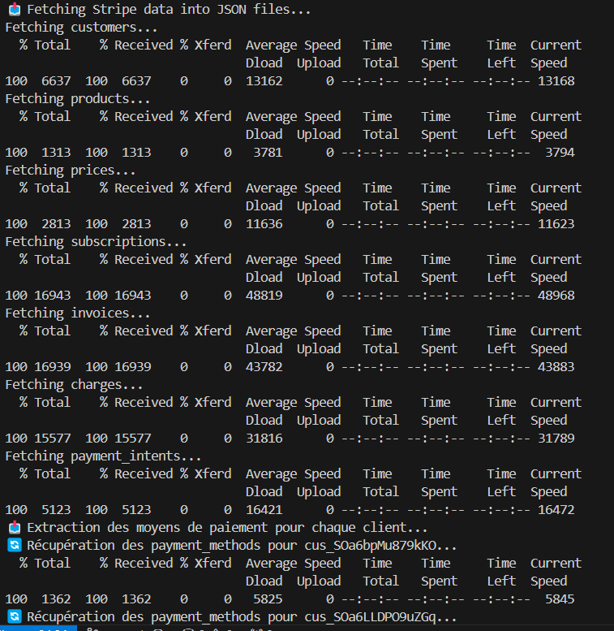
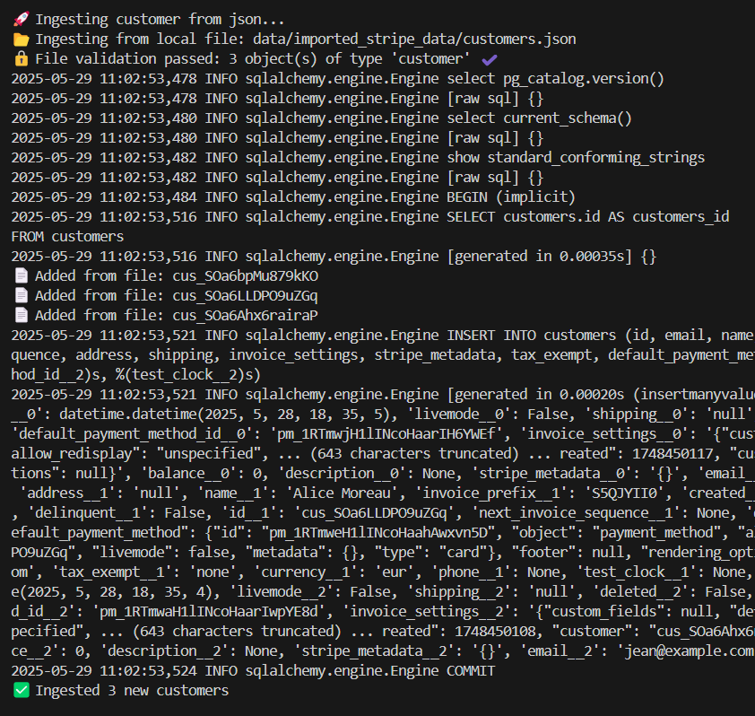
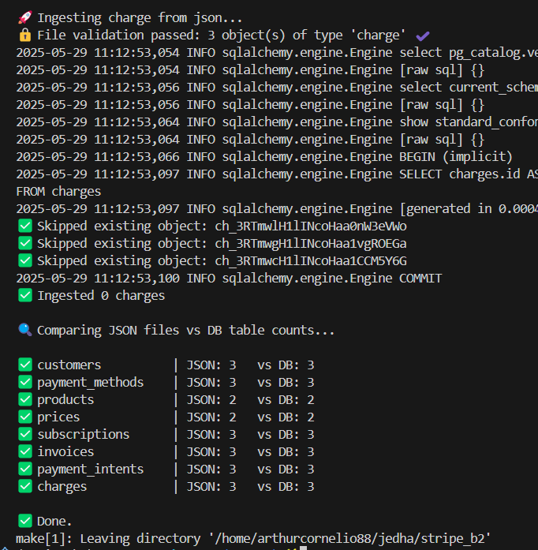

# 🏠 Stripe OLTP Data Pipeline

> End-to-end system to populate, fetch, ingest and verify transactional Stripe data in a controlled PostgreSQL environment. This README documents **everything from scripts to schema**, giving full reproducibility, safety, and insight into your OLTP foundation.

---

## 🌐 Environment-Safe Design

This pipeline is explicitly **environment-aware**. By default, everything is run in:

* `ENV=DEV`: full feature access
* `ENV=PROD`: blocks destructive/populating commands

```bash
make populate                # allowed in DEV
make populate ENV=PROD       # ❌ blocked
```

---

## 📂 Project Structure

Here's how the OLTP layer is organized, combining database models, transformers, and ingestion logic:

```
app/
├── db/
│   ├── base.py              # Base SQLAlchemy class
│   └── session.py           # DB session factory
├── models/                  # ORM classes mapping to Stripe
├── transformers/            # Stripe JSON to model converters
scripts/
├── ingest/                 # Per-table ingestion scripts
├── fetch_*.sh              # Bash scripts for Stripe API fetch
├── populate.py             # Populates sandbox using fixtures
├── check_db_integrity.py   # Validates row counts
```

The design ensures modularity, testability, and adherence to Stripe’s schema.

---

## 📆 Step 1: Create Databases & Tables

### `make init-db` runs:

* Docker Compose boot
* `init_db.py` connects via psycopg2 to create `stripe_db` and `stripe_test`
* Table creation via `Base.metadata.create_all`

```python
create_db_if_not_exists("stripe_test", admin_url)
Base.metadata.create_all(engine)  # applied to both DBs
```

The **test database** (`stripe_test`) is used by CI and Pytest for isolated evaluation.

📸 *Result after boot:*


---

## 🔖 Step 2: Migrations (Alembic)

```bash
make init-migration
```

Migrations are either:

* Created via `alembic revision --autogenerate`
* Skipped if already present

Output shown:


---

## 🚀 Step 3: Populate Stripe Sandbox

```bash
make populate
make populate-force  # resets subscriptions
```

### Highlights from `populate.py`:

* ✅ **Idempotent**: skips duplicates using `stripe.Customer.list(email=...)`
* ⚖️ Custom metadata tagging for products
* ⚖️ Price matching by value+interval+currency
* ⚡ Automatic subscription creation with tokenized card (`tok_visa`)

```python
if subscription_exists(): continue
stripe.PaymentMethod.attach(...)
stripe.Customer.modify(...)
stripe.Subscription.create(...)
```


---

## 📥 Step 4: Fetch JSON from Stripe

```bash
make fetch
```

### Scripts used:

* `fetch_stripe_data.sh`
* `fetch_payment_methods.sh`

These use `curl` to:

* Expand nested objects (e.g., customer.invoice\_settings)
* Merge all customer-linked `payment_methods` into a unified file



---

## 🧰 Step 5: Ingest to PostgreSQL

```bash
make ingest-all SOURCE=json JSON_DIR=data/imported_stripe_data
```

Each table is ingested through a three-step pipeline:

> **`ingest_{table}.py` ➔ transformer ➔ SQLAlchemy model**

This ensures:

* Clear mapping logic in transformer layer
* Clean data validation and flattening
* Separation of concerns between API data and DB models

```python
if obj["id"] not in existing_ids:
    db.add(stripe_customer_to_model(obj))
```

You can ingest:

* **All tables**: via `ingest_all.py`
* **Single table**: `make ingest-customer SOURCE=json FILE=data/imported_stripe_data/customers.json`




---

## 🔎 Step 6: Verify JSON vs DB Integrity

```bash
make check-db
```

`check_db_integrity.py` compares row counts between JSON exports and PostgreSQL tables:

```python
SELECT COUNT(*) FROM {table}
```


---

## 🧪 Schema Coverage (ex.: Customer)

Each `ingest_{table}.py` script is part of a well-structured ingestion chain:

> **`ingest_* → transformer_* → model`**

* The ingestion script parses raw JSON and **calls a transformer**.
* The transformer **maps Stripe's JSON into SQLAlchemy-compatible objects**.
* The ORM object is then added to the DB session using `db.add(...)`.

This pipeline ensures:

* Full decoupling from external schemas
* Proper field typing and JSON flattening
* High readability and maintainability

### Model: `app/models/customer.py`

```python
class Customer(Base):
    ...
    deleted = Column(Boolean, default=False)  # supports stripe deletion
    address = Column(JSONB)
    test_clock = Column(String)
```

Supports:

* Nested fields like `address`, `shipping`, `invoice_settings`
* Optional and nullable fields
* Stripe-specific metadata (`livemode`, `deleted`, etc.)

### Transformer: `stripe_customer_to_model()`

```python
default_payment_method_id = (
    data.get("invoice_settings", {}).get("default_payment_method", {}).get("id")
)
```

The transformer:

* Validates structure
* Handles optional nested keys
* Converts UNIX timestamps to Python `datetime`

---

## 📊 Summary: What You Get

| Layer    | Tool       | Behavior                        |
| -------- | ---------- | ------------------------------- |
| Infra    | Docker     | Compose PostgreSQL + volumes    |
| Schema   | Alembic    | Migrations auto-managed         |
| Populate | Stripe SDK | Custom idempotent API calls     |
| Fetch    | cURL/bash  | Expanded + batched object pulls |
| Ingest   | SQLAlchemy | Per-table validators + mappers  |
| Verify   | Python     | Row-count diff checker          |

---

## 📜 Appendix: Scripts Glossary

| File                       | Description                         |
| -------------------------- | ----------------------------------- |
| `init_db.py`               | Creates databases via psycopg2      |
| `populate.py`              | Populates Stripe sandbox w/ fixture |
| `fetch_stripe_data.sh`     | Fetches core Stripe objects         |
| `fetch_payment_methods.sh` | Fetches customer-linked methods     |
| `ingest/ingest_{table}.py` | Table-specific JSON ingestion       |
| `ingest_all.py`            | Ingests all in dependency order     |
| `check_db_integrity.py`    | Compares row counts (JSON vs DB)    |

---

To go further with schema diagrams and OLAP extensions, see the [main README](../README.md) or `docs/`.
