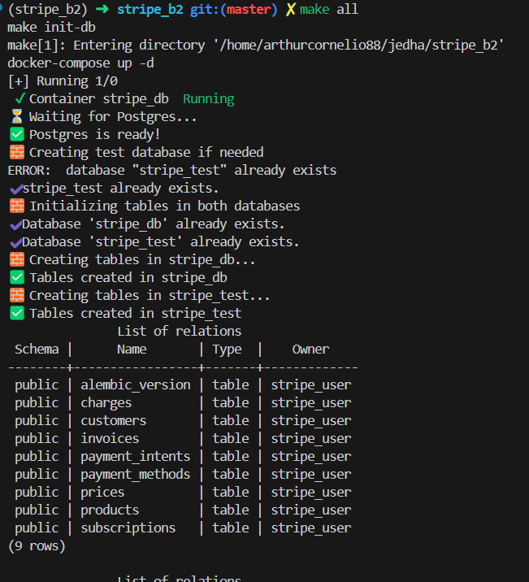
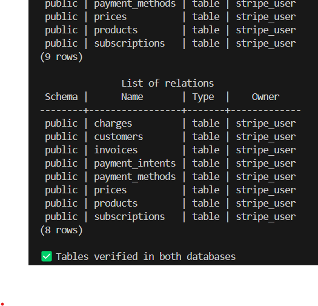
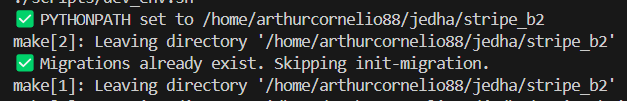
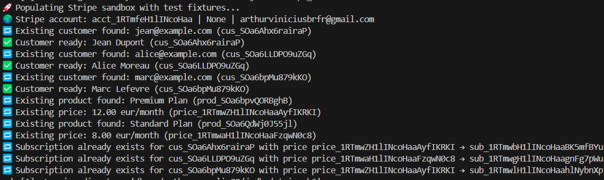
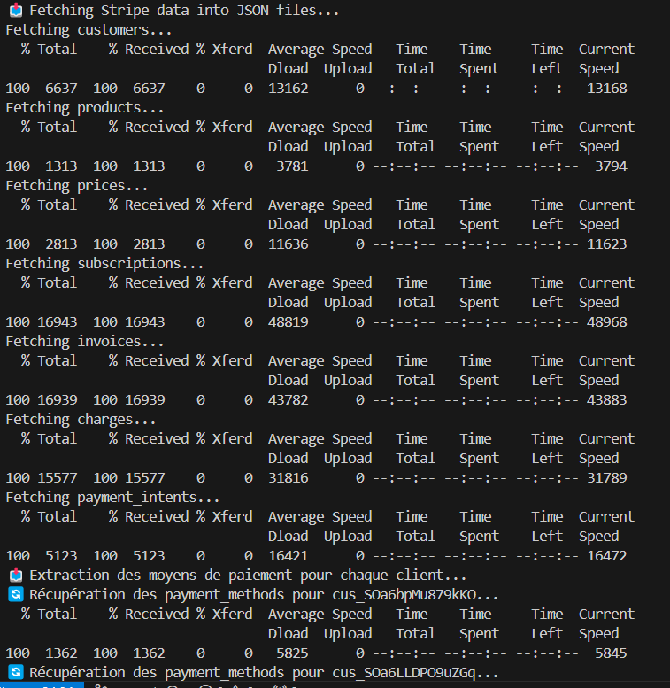
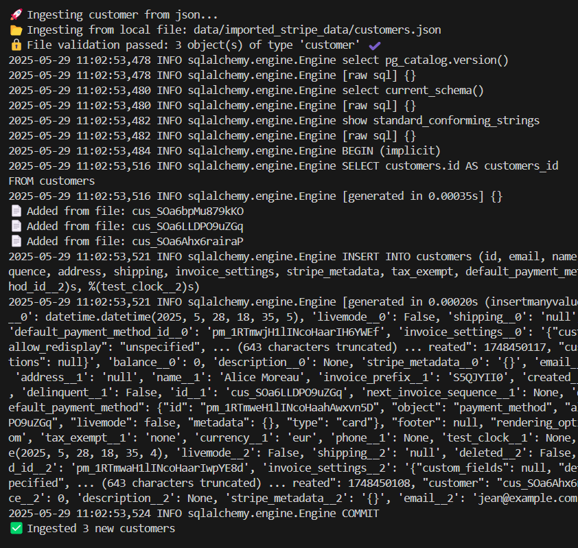
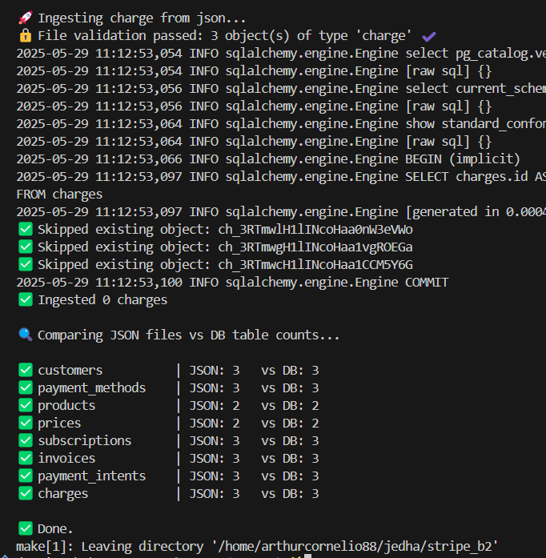
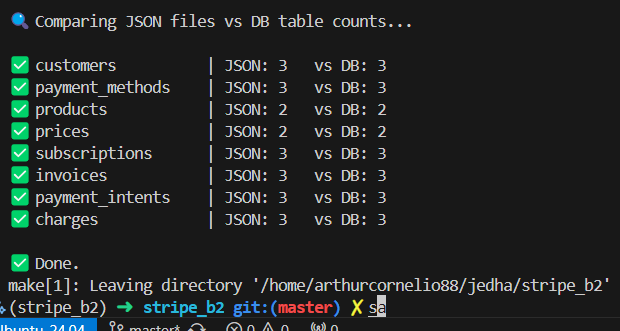

# 🏠 Stripe OLTP Data Pipeline

> End-to-end system to populate, fetch, ingest and verify transactional Stripe data in a controlled PostgreSQL environment. This README documents **everything from scripts to schema**, giving full reproducibility, safety, and insight into your OLTP foundation.

---

## 🌐 Environment-Safe Design

This pipeline is explicitly **environment-aware**. By default, everything is run in:

* `ENV=DEV`: full feature access
* `ENV=PROD`: blocks destructive/populating commands

```bash
make populate                # allowed in DEV
make populate ENV=PROD       # ❌ blocked
```

---

## 📂 Step 1: Create Databases & Tables

### `make init-db` runs:

* Docker Compose boot
* `init_db.py` to connect via psycopg2 and create `stripe_db` and `stripe_test` if missing
* Table creation via `Base.metadata.create_all`

```python
create_db_if_not_exists("stripe_test", admin_url)
Base.metadata.create_all(engine)  # applied to both DBs
```

The **test database** (`stripe_test`) ensures every migration & ingestion script can be verified without mutating the primary.

📸 *Result after boot:*




---

## 🔖 Step 2: Migrations (Alembic)

```bash
make init-migration
```

Migrations are either:

* Created via `alembic revision --autogenerate`
* Skipped if already present

Output shown:



---

## 🚀 Step 3: Populate Stripe Sandbox

```bash
make populate
make populate-force  # resets subscriptions
```

### Highlights from `populate.py`:

* ✅ **Idempotent**: skips duplicates using `stripe.Customer.list(email=...)`
* ⚖️ Custom metadata tagging for products
* ⚖️ Price matching by value+interval+currency
* ⚡ Automatic subscription creation with tokenized card (`tok_visa`)

```python
if subscription_exists(): continue
stripe.PaymentMethod.attach(...)
stripe.Customer.modify(...)
stripe.Subscription.create(...)
```



---

## 📥 Step 4: Fetch JSON from Stripe

```bash
make fetch
```

### Scripts used:

* `fetch_stripe_data.sh`
* `fetch_payment_methods.sh`

These use `curl` to:

* Expand nested objects (e.g., customer.invoice\_settings)
* Merge all customer-linked `payment_methods` into a unified file

Structure saved in `data/imported_stripe_data/`



---

## 🧰 Step 5: Ingest to PostgreSQL

```bash
make ingest-all SOURCE=json JSON_DIR=data/imported_stripe_data
```

### For each table:

* Validates JSON type & structure
* Applies custom Pydantic transformer (`stripe_customer_to_model()`)
* Adds new entries only (idempotent)

```python
if obj["id"] not in existing_ids: db.add(...)
```

You can ingest:

* **All**: via `ingest_all.py`
* **One table**: `make ingest-customer SOURCE=json FILE=...`



---

## 🔎 Step 6: Verify JSON vs DB Integrity

```bash
make check-db
```

Runs `check_db_integrity.py`, which:

* Loads every JSON file
* Counts records by table
* Compares to DB via SQLAlchemy connection

```python
SELECT COUNT(*) FROM {table}
```

Output:



---

## 🧪 Schema Coverage (Customer)

### Model: `app/models/customer.py`

```python
class Customer(Base):
    ...
    deleted = Column(Boolean, default=False)  # supports stripe deletion
    address = Column(JSONB)
    test_clock = Column(String)
```

### Transformer: `stripe_customer_to_model()`

```python
default_payment_method_id = (
    data.get("invoice_settings", {}).get("default_payment_method", {}).get("id")
)
```

---

## 🎯 Summary: What You Get

| Layer    | Tool       | Behavior                        |
| -------- | ---------- | ------------------------------- |
| Infra    | Docker     | Compose PostgreSQL + volumes    |
| Schema   | Alembic    | Migrations auto-managed         |
| Populate | Stripe SDK | Custom idempotent API calls     |
| Fetch    | cURL/bash  | Expanded + batched object pulls |
| Ingest   | SQLAlchemy | Per-table validators + mappers  |
| Verify   | Python     | Row-count diff checker          |

---

## 💼 Appendix: Script Index (`scripts` folder)

* `init_db.py`: DB creation (admin connection)
* `populate.py`: Main population logic
* `fetch_stripe_data.sh`: Core resource fetching
* `fetch_payment_methods.sh`: Per-customer methods
* `ingest_all.py`: Ordered ingestion orchestrator
* `check_db_integrity.py`: Final sanity check