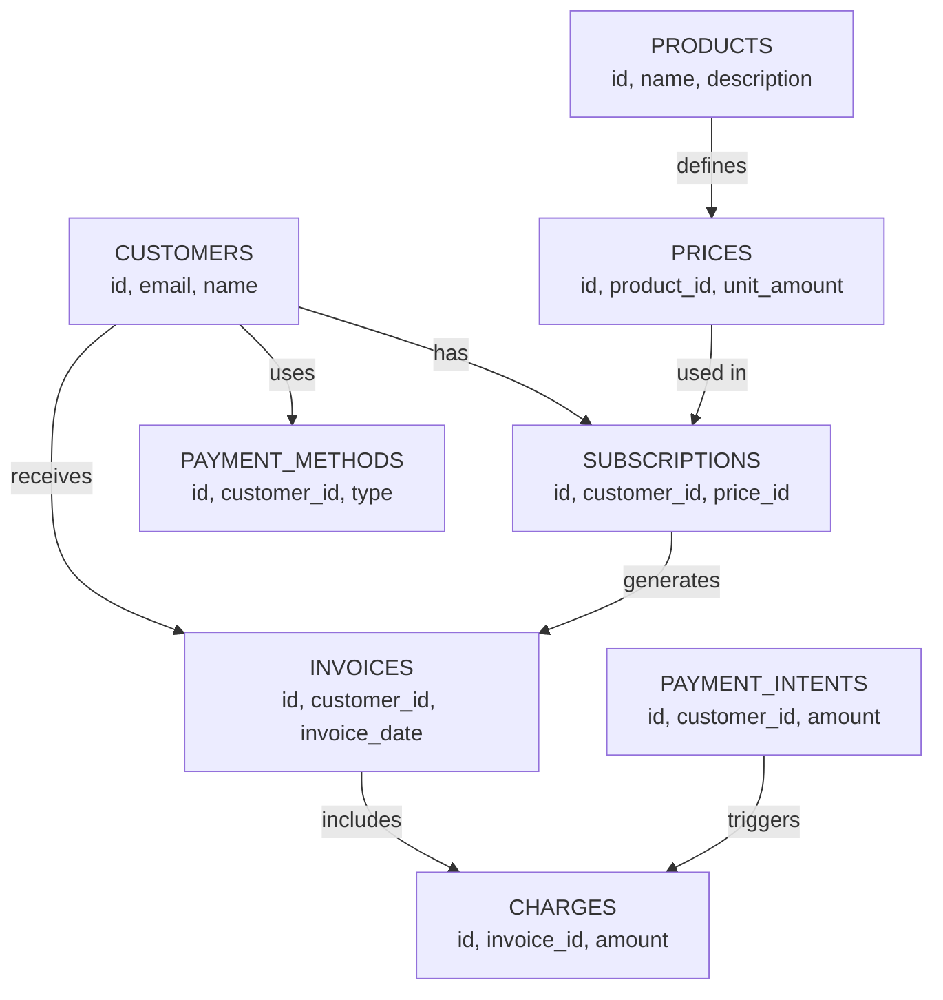

```mermaid
graph TD
  CUSTOMERS["CUSTOMERS<br/>id, email, name"]
  PRODUCTS["PRODUCTS<br/>id, name, description"]
  PRICES["PRICES<br/>id, product_id, unit_amount"]
  SUBSCRIPTIONS["SUBSCRIPTIONS<br/>id, customer_id, price_id"]
  INVOICES["INVOICES<br/>id, customer_id, invoice_date"]
  CHARGES["CHARGES<br/>id, invoice_id, amount"]
  PAYMENT_METHODS["PAYMENT_METHODS<br/>id, customer_id, type"]
  PAYMENT_INTENTS["PAYMENT_INTENTS<br/>id, customer_id, amount"]

  CUSTOMERS -->|has| SUBSCRIPTIONS
  CUSTOMERS -->|uses| PAYMENT_METHODS
  CUSTOMERS -->|receives| INVOICES
  PRODUCTS -->|defines| PRICES
  PRICES -->|used in| SUBSCRIPTIONS
  SUBSCRIPTIONS -->|generates| INVOICES
  INVOICES -->|includes| CHARGES
  PAYMENT_INTENTS -->|triggers| CHARGES
```