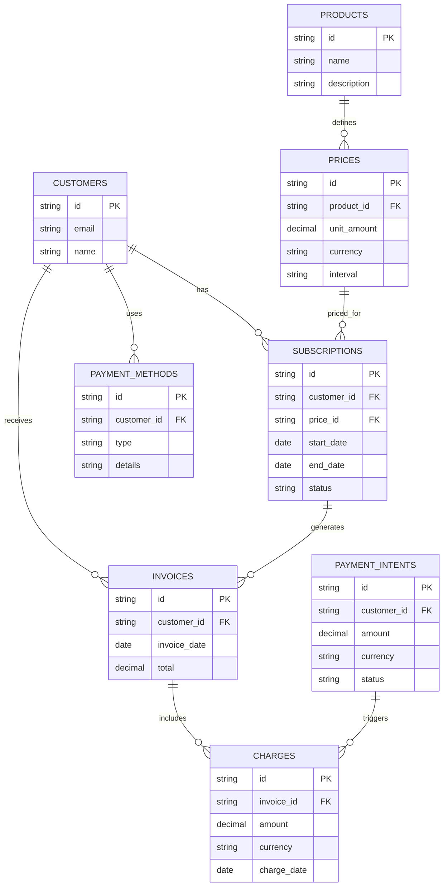

```mermaid
erDiagram
  CUSTOMERS {
    string id PK
    string email
    string name
  }

  PRODUCTS {
    string id PK
    string name
    string description
  }

  PRICES {
    string id PK
    string product_id FK
    decimal unit_amount
    string currency
    string interval
  }

  SUBSCRIPTIONS {
    string id PK
    string customer_id FK
    string price_id FK
    date start_date
    date end_date
    string status
  }

  INVOICES {
    string id PK
    string customer_id FK
    date invoice_date
    decimal total
  }

  CHARGES {
    string id PK
    string invoice_id FK
    decimal amount
    string currency
    date charge_date
  }

  PAYMENT_METHODS {
    string id PK
    string customer_id FK
    string type
    string details
  }

  PAYMENT_INTENTS {
    string id PK
    string customer_id FK
    decimal amount
    string currency
    string status
  }

  CUSTOMERS ||--o{ SUBSCRIPTIONS : has
  CUSTOMERS ||--o{ PAYMENT_METHODS : uses
  CUSTOMERS ||--o{ INVOICES : receives
  PRODUCTS ||--o{ PRICES : defines
  PRICES ||--o{ SUBSCRIPTIONS : priced_for
  SUBSCRIPTIONS ||--o{ INVOICES : generates
  INVOICES ||--o{ CHARGES : includes
  PAYMENT_INTENTS ||--o{ CHARGES : triggers
```